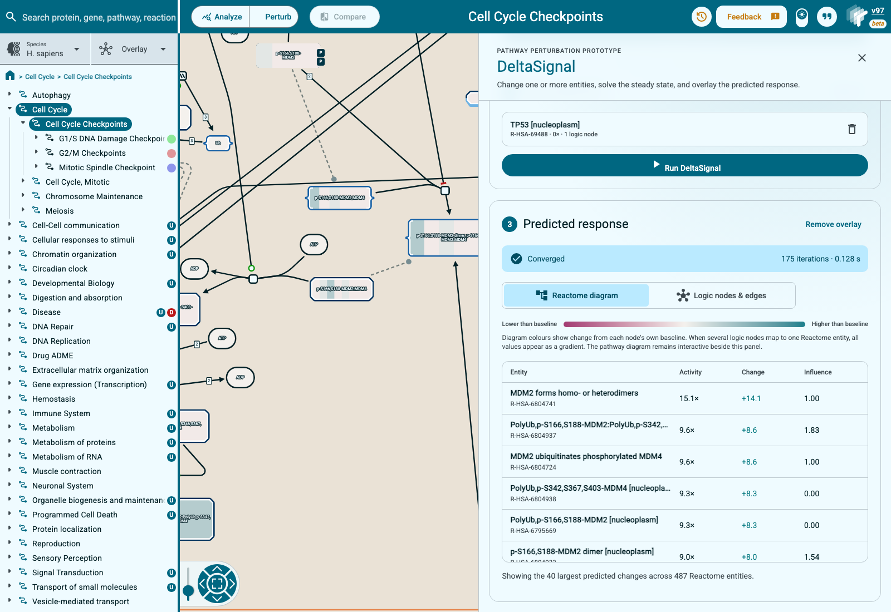

# DeltaSignal pathway perturbation prototype

This prototype connects the Reactome Pathway Browser to the DeltaSignal
steady-state solver. A user can change one or more molecules, run a prediction,
and inspect the response in two complementary views:

1. the familiar Reactome diagram, coloured by predicted change; and
2. the underlying LNG logic nodes and edges, where position-aware UUIDs remain
   separate.

The feature is an interface to an existing model. It does not change
DeltaSignal's propagation rules, and the visualization is not evidence that a
prediction is biologically correct.



## Run a prediction

1. Open a pathway for which the DeltaSignal API has a generated LNG network.
2. Choose **Perturb** in the Pathway Browser toolbar.
3. Select a physical entity on the diagram, not an event in the pathway tree.
4. Set its activity and choose **Add perturbation**.
5. Repeat the selection step if the prediction needs more than one input.
6. Choose **Run DeltaSignal**.
7. Check the convergence message before interpreting the result.
8. Use **Reactome diagram** or **Logic nodes & edges** to change the result
   view.

The panel is a side drawer, so the pathway diagram remains visible and
interactive while the controls are open. On a narrow screen the drawer expands
to the full viewport.

If the panel says that an entity is not represented, the selected Reactome
stable identifier has no matching node in the parsed LNG network. The UI does
not substitute another molecule or silently drop the selection.

## Activity scale

The input control uses DeltaSignal's activity scale:

|            Value | Meaning                       |
| ---------------: | ----------------------------- |
|              `0` | knockout or no input activity |
|              `1` | normal baseline activity      |
| greater than `1` | activation above baseline     |

The quick activation preset is `80`, which is intentionally a strong
perturbation. The number is a relative model input, not a measured expression
fold change. It should not be described as 80-fold RNA expression.

The solver returns internal activities on a 0 to 1 scale. The client multiplies
them by 100 for display, so a displayed baseline of `100x` corresponds to the
internal baseline value `1.0`.

## Reactome diagram view

Diagram colour shows the predicted change from each logic node's own baseline:

- blue means lower activity;
- near-white means little change;
- red means higher activity.

A Reactome entity can expand into several LNG logic nodes. This occurs when the
same stable identifier has different positional or logical roles in the
generated network. The diagram keeps every member value and renders a gradient
when those values differ. The accompanying result table is intentionally more
compact: it shows one row per Reactome stable identifier, uses the mean member
activity and change, and keeps the largest member influence score.

The table is limited to the 40 largest absolute changes. This is a display
limit, not a solver limit. The complete result remains available in the API
response.

## Logic nodes and edges view


This view exposes the graph that DeltaSignal actually solved. It is useful for
checking how Reactome entities were expanded by LNG and for following a
prediction through reactions, complexes, sets, and sequence entities.

The graph contains the 40 UUID-level nodes with the largest absolute predicted
changes, plus every perturbed input even if it falls outside that limit. An
edge is drawn only when both endpoints are visible. The view therefore never
draws an apparent direct connection through an omitted node.

### Reading the graph

- Node colour uses the same lower/neutral/higher scale as the diagram overlay.
- Node size increases with the absolute influence score.
- A thick amber border marks a perturbed input.
- Diamonds are reactions.
- Rounded rectangles are complexes or sets.
- Hexagons are DNA or RNA sequence entities.
- Teal arrows are positive edges.
- Magenta arrows are negative edges.
- Solid edges are AND relationships.
- Dashed edges are OR relationships.

Selecting a node opens its Reactome stable identifier, exact LNG UUID, entity
kind, baseline, predicted activity, change, influence, and mapping
multiplicity. Mapping multiplicity is the number of UUIDs in the solved network
that share that Reactome stable identifier.

The layout is an interactive Cytoscape view. Users can pan, zoom, select nodes,
and use the fit button to restore the full subgraph.

## API contract

The Angular client calls the DeltaSignal API through the development or
production proxy:

- `GET /api/pathways` lists available generated pathways;
- `POST /api/parse { pathway_id }` parses one network and returns nodes, edges,
  and mappings;
- `POST /api/solve { network_id, observations }` returns activities, influence
  scores, convergence status, iteration count, and solve time.

When one selected Reactome entity maps to several UUIDs, the same observation
is sent to every matching UUID. The UUIDs are not merged before solving.

## Local development

Clone the three repositories in any convenient locations:

```sh
git clone git@github.com:reactome/WebsiteAngular.git
git clone git@github.com:reactome/deltasignal.git
git clone git@github.com:reactome/logic-network-generator.git
```

Generate or obtain an LNG catalog containing one directory per pathway. Each
pathway directory must contain `logic_network.csv` and
`stid_to_uuid_mapping.csv`.

Start the DeltaSignal API:

```sh
DS_PATHWAY_CATALOG=/path/to/lng/output \
  julia --project=/path/to/deltasignal \
  /path/to/deltasignal/src/api/server.jl \
  --host=127.0.0.1 --port=8080
```

Then start the Pathway Browser:

```sh
REACTOME_BACKEND=https://reactome.org \
DELTASIGNAL_BACKEND=http://127.0.0.1:8080 \
npm run start:simple -- --host 127.0.0.1
```

Open a pathway available in the generated catalog. For example:

```text
http://127.0.0.1:4200/PathwayBrowser/R-HSA-69620
```

The Angular development proxy sends `/api` to `DELTASIGNAL_BACKEND`. If this
variable is omitted, it defaults to `http://localhost:8080`.

## Verification

The graph-selection and truncation behavior is covered by focused unit tests:

```sh
npx vitest run \
  projects/pathway-browser/src/app/deltasignal/deltasignal.utils.spec.ts
```

The complete development build is checked with:

```sh
npx ng build --configuration development
```

The manual browser check used Cell Cycle Checkpoints (`R-HSA-69620`), selected
TP53, set activity to `0`, ran DeltaSignal, inspected the Reactome overlay, and
then selected the TP53 UUID in the logic graph. The run converged in 175
iterations and the graph displayed 40 nodes and 40 retained edges.

## Current boundary

The prototype solves and visualizes one generated pathway at a time. It does
not yet join neighboring pathway networks or calculate one defensible activity
score for every ReacFoam region. A ReacFoam overlay would first require an
explicit cross-pathway aggregation rule and a catalog broad enough to support
it. Adding coloured regions before those choices are defined would make the UI
look more complete than the model underneath it.

The current nodes-and-edges view was therefore implemented first. It exposes
the exact graph already returned by DeltaSignal and gives a direct way to audit
LNG expansion, edge signs, logic relationships, and UUID mappings.
